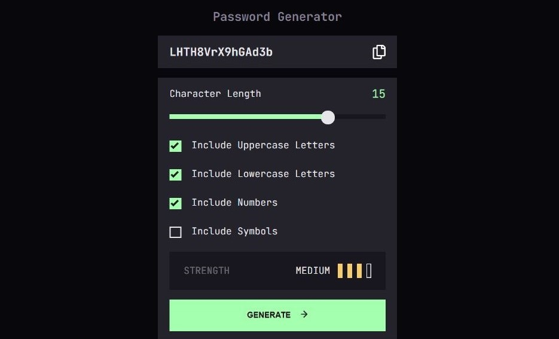

<h1>Password Generator</h1>

Website: <a href="#">Click here</a>

<h2>Table of contents</h2>

- [Overview](#overview)
- [Features](#features)
- [Functionality](#functionality)
- [Code Summary](#code-summary)
- [Continued development](#continued-development)
- [Author](#author)
- [Acknowledgments](#acknowledgments)

## Overview

- This project is basically a random password generator built using HTML, CSS, and JavaScript.
- A password generator is a software or tool that creates random or customized passwords for users. These types of passwords contain different combinations of characters such as letters, numbers, symbols, etc.
- This password generator web page provides a user-friendly interface for generating passwords with various options for length and character types, along with a default setting of 10 characters including lowercase letters.

## Features

Users can:

- Generate a password based on the selected inclusion options.
- Copy the generated password to the computer’s clipboard.
- See a strength rating for their generated password.
- See hover states for all interactive elements on the page.

## Functionality

- The users can choose an input range by moving the slider to select a character length, which is displayed on the page. This feature is useful for generating a password of a specific length. This password generator allows users to select an input range from 0 to 20 having 10 as a default setting.
- The password generator uses checkboxes to allow the users to select which types of characters they want in their password (e.g. uppercase letters, lowercase letters, numbers, symbols). It then assesses the password based on the selected checkboxes and password length and assigns a strength rating (e.g. weak, medium, strong).
- The generator also updates the appearance of the strength rating on the page using CSS classes. This is a useful feature as it provides feedback to the users on the strength of their password.
- The new password is displayed in the text input field when the user clicks on the `Generate` button.
- The password generator also adds functionality to a `copy` button on a webpage. When the button is clicked, the text inside a password field is copied to the user's clipboard. This allows the user to easily paste the password into another field or application.

## Code Summary

- The HTML code is an essential component of the password generator web page that serves as the foundation for the page's structure and facilitates accessibility. The code includes semantic tags such as "main," "h1," "form," "label," and "input," which are crucial for organizing the content and making it easy to access. By using these tags, the page becomes more user-friendly and improves the overall user experience.
- We can identify two main HTML divisions - container-input and container-box. Container-box contains a password field that displays new password combinations to the users, along with a `copy` button. Container-input contains a slider and count for the password range, along with custom checkboxes and password strength rating. The container ends with a `generate` button. The two main divisions of the HTML code provide a clear structure to the page, making it easy for users to navigate and generate passwords.
- In addition to the semantic tags used in the HTML code, the page also includes a custom checkbox design using CSS. The checkboxes are hidden and replaced with a custom design using absolute positioning and a border. When the checkbox is checked, the border and background color change to green, and a checkmark icon is displayed. This provides a more visually appealing and user-friendly interface for selecting the desired character types for the password.
- The slider for selecting the password length also includes custom styling using CSS. The slider thumb is replaced with a circle, and the track is split into two sections using custom tracks. The left side of the track is colored green to indicate the selected password length, and the right side of the track is colored dark to indicate the remaining password length. The password length value is displayed above the slider thumb, and updates dynamically as the slider is moved.
- The password generator web page also uses JavaScript code to define functions that generate passwords, update the password display, and calculate the strength rating of the password based on the selected options. The password generation function is a critical feature of the page, as it uses arrays of character types and the Math.random() function to create a unique password with the selected length and character types. The password display is also a crucial aspect of the page, and it is updated using the innerHTML property to set the text content of the password element. The strength rating is updated using CSS classes to change the color and position of the rating bar based on the calculated strength.
- Finally, the password strength rating is displayed using a color-coded bar and text label. The rating bar is updated dynamically based on the selected password length and character types. The bar is split into four sections, each with a different color and label to indicate the strength of the password. The text label is also updated based on the selected options and provides additional feedback to the user regarding the strength of the password.

## Continued Development

- As I continue to develop this password-generator web page, I am exploring the possibility of creating an entire commercial password-generator web page. This would involve creating a more comprehensive tool that could be used by individuals and businesses alike to generate strong and secure passwords.
- In addition to this, I am also focusing on creating an optimal layout for the interface that can adapt to various device screen sizes. By doing so, the web page can be easily accessed and used on a variety of devices, from desktop computers to mobile phones and tablets.
- Overall, my continued development of this password generator web page is aimed at providing users with a user-friendly and secure tool for generating strong passwords. Through ongoing improvements and enhancements, I hope to create a tool that is accessible to all users and helps to improve online security for everyone who uses it.

## Author

- Website - [Sikta Mohanty](https://github.com/Sikta2002)
- Frontend Mentor - [@Sikta2002](https://www.frontendmentor.io/profile/Sikta2002)
- Twitter - [@moonsikta](https://twitter.com/moonsikta)

## Acknowledgments

- This project is inspired by a [Frontend Mentor challenge](https://www.frontendmentor.io/challenges/password-generator-app-Mr8CLycqjh).
